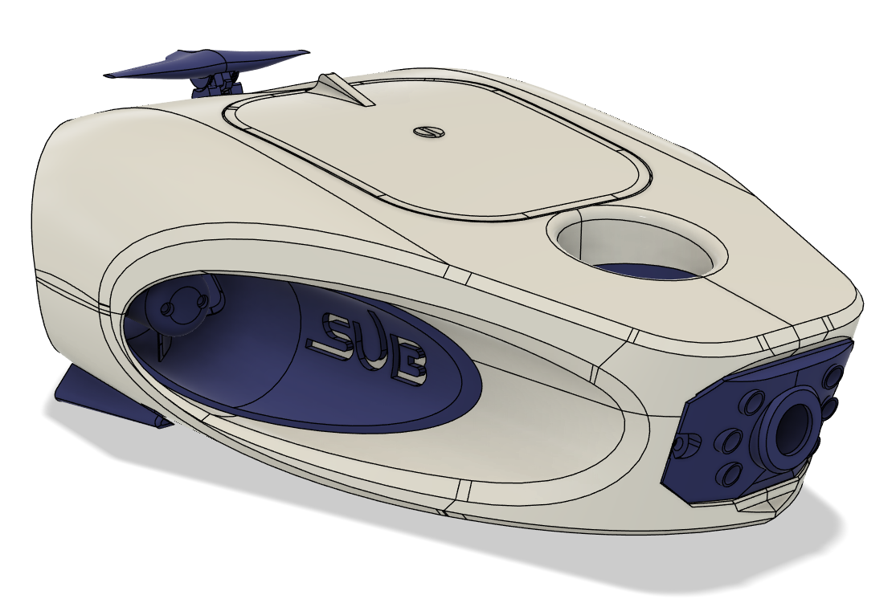

# 🚤 ROV – Remotely Operated Vehicle

**ROV (Remotely Operated Vehicle)** est un projet personnel de sous‑marin téléopéré conçu pour l’exploration sous‑marine légère.  
L’objectif est de créer un engin maniable, stable et silencieux, plutôt orienté observation que vitesse.

---

## 🔍 Description du projet

Ce ROV est un véhicule sous‑marin télécommandé (Remote Operated Vehicle) construit autour d’un microcontrôleur **Black Pill STM32F401CC** et conçu pour fonctionner jusqu’à ~10 m de profondeur dans un boîtier étanche imprimé en 3D. :contentReference

Le ROV est capable de :

- 🚀 propulsion via 4 moteurs brushless + ESC  
- 📏 asservissement en pitch, yaw et profondeur  
- 🧠 commandes via joystick / station PC  
- 🧭 capteurs de navigation (IMU, pression)  
- 📡 télémétrie en temps réel (attitude, profondeur, température)  
- 🔄 protocole de communication RS485 demi‑duplex  
- 🧪 vecteurs de télécommande + tuning PID paramétrable

---

## ⚙️ Caractéristiques techniques

**Matériel principal :**  
- 🧠 Microcontrôleur : Black Pill STM32F401CC  
- ⚙️ Propulsion : 4× moteurs brushless + ESC 2212 920KV  
- 🧭 Capteurs : IMU BNO08x, capteur de pression MS5837  
- 📡 Communication : RS485 (MAX485)  
- 💧 Boîtier étanche imprimé en PETG + plexiglas  
- 🔌 Ballast actif avec pompe péristaltique et driver DRV8871 

---

## 🧪 Fonctionnalités implémentées

- 🔁 Asservissement PID pour pitch, yaw et profondeur  
- ⚙️ Calibration ESC au démarrage  
- 📊 Télémétrie (accélération, orientation, profondeur, pression, température)  
- 📡 Protocole binaire sur RS485 pour commandes et retour  
- 🛟 Gestion des automatismes failsafe

---

## 🛠️ Installation & Développement

### Pré-requis

Avant de commencer, assure‑toi d’avoir :

- 📌 **PlatformIO** avec **VS Code**
- 📌 Core STM32 pour PlatformIO
- 📌 Bibliothèques suivantes dans PlatformIO :  
  - Adafruit BNO08x  
  - PID_v1  
  - BlueRobotics MS5837  
  - (et autres dépendances selon tes sources)

